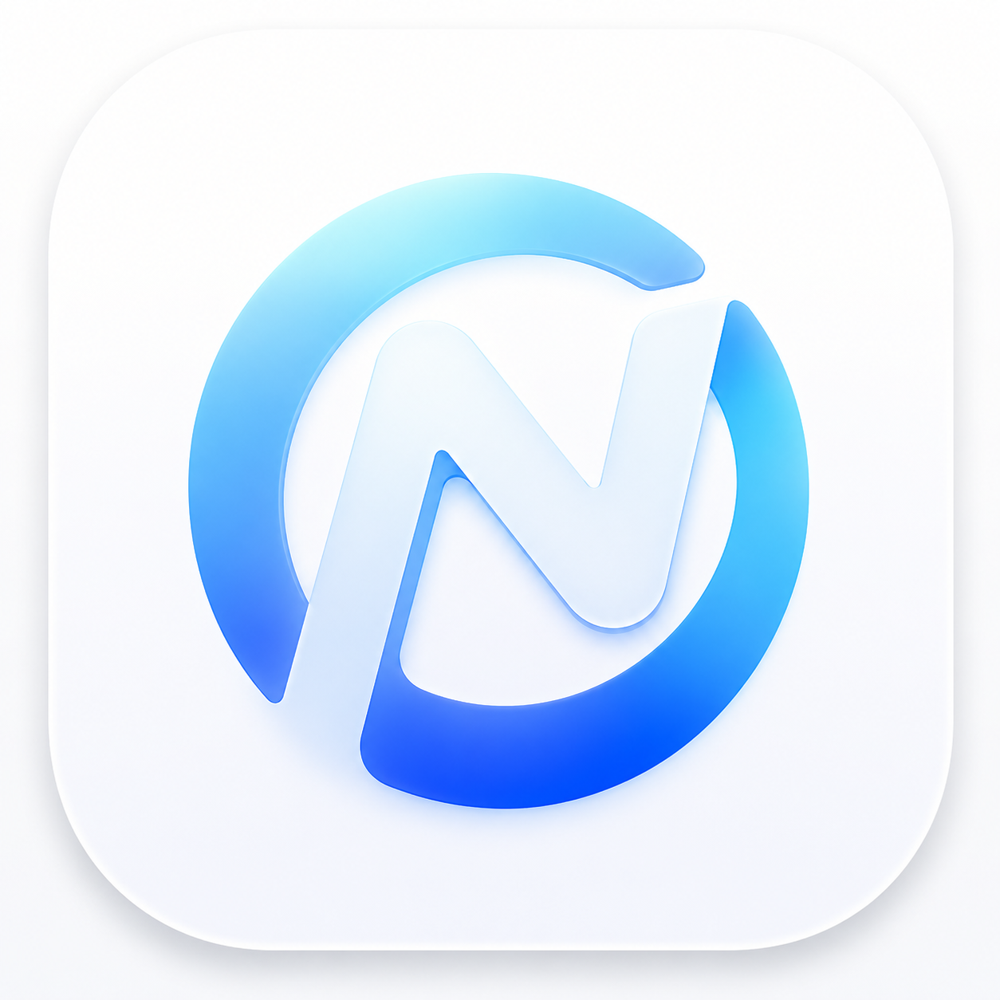

基于 GPUI 构建的跨平台桌面 Agent

  <a href="README.md">English</a> |
  <a href="README.zh.md">简体中文</a>

---

# Norma

Norma 是一个基于 GPUI 构建的跨平台桌面 Agent，为开发者和专业用户提供统一、高效、可扩展的 AI 工作环境。

通过整合多模型能力、MCP 工具生态、Skills 插件系统以及 Multi-Agent 协作机制，Norma 能够帮助用户完成从信息处理、代码开发到自动化任务执行的各类工作。

## 功能

### 支持多种模型提供商

支持 OpenAI、Anthropic、Gemini、Qwen、DeepSeek、OpenRouter 以及兼容 OpenAI API 的模型服务。

根据不同任务场景灵活选择最适合的模型。

### 支持 MCP 协议

原生支持 Model Context Protocol（MCP）。

轻松接入数据库、Git 仓库、本地工具、企业知识库和第三方服务，为 Agent 提供丰富的工具能力。

### 支持 ACP 协议

支持 Agent Communication Protocol（ACP）。

实现 Agent 之间的标准化通信、任务协作与上下文共享。

### 支持 skill

通过可扩展的 Skills 系统扩展 Agent 能力。

支持开发、运维、数据分析、安全研究、文档处理等多种场景。

### Sub-Agent

支持动态创建 Sub-Agent。

复杂任务可以自动拆分并并行执行，提高任务处理效率。

### Multi-Agent

支持多个 Agent 协同工作。

不同 Agent 可以承担规划、调研、开发、审查等角色，共同完成复杂任务。

### Cross Platform

基于 GPUI 构建，提供现代化原生桌面体验。

支持：

- macOS
- Linux
