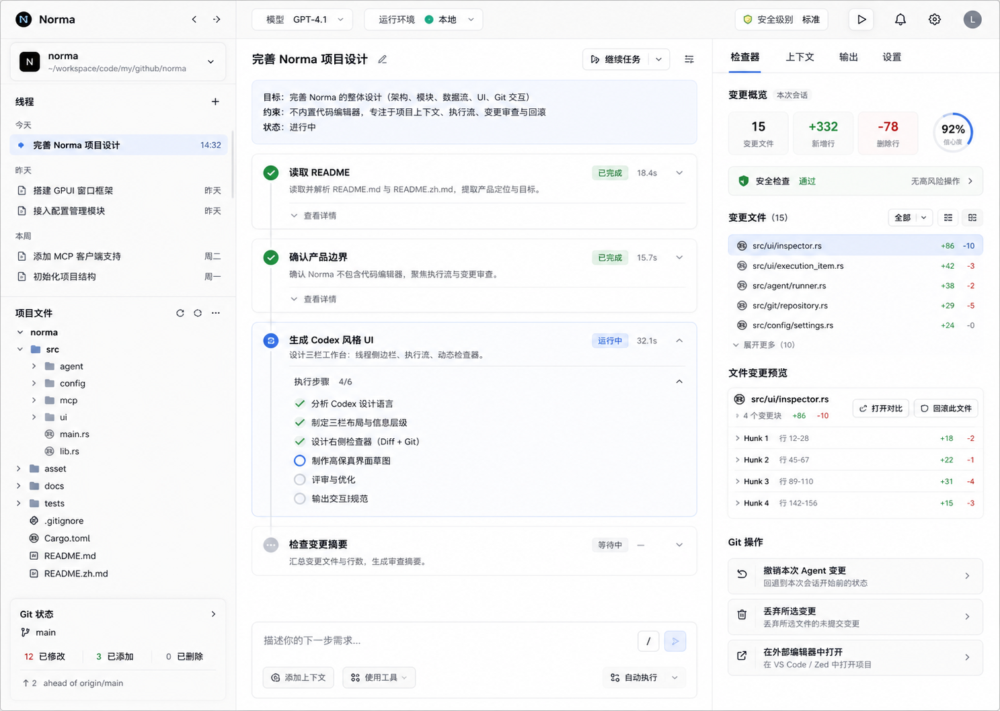

# Norma Project Workbench Design

Date: 2026-06-11

## Summary

Norma V1 is a project-session desktop agent workbench built with Rust and GPUI. It should feel close to Codex: calm, native, thread-based, evidence-oriented, and focused on helping developers understand what the agent did.

The first implementation is intentionally scoped to a UI shell with real local project context. It opens a project, shows project files and Git status, lets the user create project threads, renders a Codex-style execution stream, and uses a mock agent runtime to produce traceable events. It does not call real models, modify code, run destructive commands, or implement the full README feature set yet.

Selected visual direction: **Review-First Codex Workbench**.

## Product Positioning

Norma is not a code editor and should not try to replace VS Code, Zed, or other editors. Code editing remains outside Norma. Norma's role is to provide:

- project context
- agent execution traces
- diff and change summaries
- compare-view entry points
- safe Git rollback and undo operations
- future model, MCP, Skills, ACP, and multi-agent orchestration surfaces

The V1 product flow is:

1. Open a local project directory.
2. Create or select a project thread.
3. Ask Norma to inspect, explain, or plan work.
4. Watch the execution stream.
5. Review project context, Git status, and mock change summaries in the dynamic inspector.

## Scope

### In Scope For V1

- GPUI desktop shell with a three-column workbench.
- Codex-inspired visual language: restrained surfaces, clear typography, light sidebars, thin dividers, compact rows, and a review-first right panel.
- Project/session sidebar with current project, thread list, file tree entry points, and Git summary.
- Real local project root loading.
- Real file tree reading.
- Basic Git status reading.
- Thread model and event stream model.
- `AgentRuntime` abstraction.
- `MockAgentRuntime` that emits deterministic project-task events.
- Dynamic inspector modes for context, changes, and approval.
- Disabled or mock-safe affordances for future compare, revert, and undo actions.
- Clear documentation of what is implemented now and what remains future work.

### Out Of Scope For V1

- Embedded code editor.
- Real LLM provider integration.
- Real command execution.
- Real file writes or patch application.
- Real diff hunk editing.
- Destructive Git operations.
- MCP runtime integration.
- Skills runtime integration.
- ACP, Sub-Agent, or Multi-Agent execution.

## Architecture

Norma should be split into small modules under `src/` as the codebase grows:

- `ui`: GPUI views, layout, visual states, and event rendering.
- `workspace`: project root, file tree, file metadata, and workspace errors.
- `git`: Git status, changed file summaries, diff stats, and future Git action requests.
- `session`: project threads, session events, event aggregation, and inspector state.
- `agent`: `AgentRuntime` trait, mock runtime, and future model/tool runtimes.
- `config`: recent projects, window state, and future model/MCP/Skills settings.

`main.rs` should stay small. It should initialize the app, load configuration, construct the top-level application state, and mount the root GPUI view.

## UI Design

### Layout

The main window uses three columns:

- Left: simplified project/thread sidebar.
- Center: Codex-style execution stream.
- Right: dynamic inspector.

The UI should not look like a wireframe or generic dashboard. It should use a native desktop feel with efficient spacing, readable 13-15px product typography, subtle separators, minimal borders, and restrained accent colors.

### Left Sidebar

The left sidebar is project and thread first. It includes:

- current project switcher
- current project path
- thread list grouped by project
- compact file tree access
- Git status summary
- small settings/capabilities entry

MCP, Skills, model selection, and automation should not become a dense control panel in V1. They can appear as small future-facing entry points.

### Center Execution Stream

The center is not a chat bubble UI. It is a task thread that shows what happened:

- user task
- agent plan
- tool call started/finished events
- command output summaries
- project context events
- change summary events
- final response
- error events

Events should be compact, chronologically ordered, and easy to scan. Details can be collapsed, but the user should always understand the agent's next step and current state.

### Right Dynamic Inspector

The right panel is a state-driven inspector, not a static utility drawer. Modes:

- Context: project root, selected files, runtime status, Git summary.
- Changes: changed file count, inserted/deleted lines, file-level diff list, hunk counts, compare entry points.
- Approval: pending actions, safety warnings, and confirmation controls.

When there are changes, the inspector becomes a review dashboard. It should show:

- number of changed files
- line count summary
- changed file list
- per-file status
- compare action
- revert file action
- undo last agent change action
- open external editor action

V1 may show disabled or mock states for actions that are not safe or implemented yet. The design must make the boundary visible.

## Data Flow

Data flows from project context to session events to inspector state:

1. `workspace` loads the selected project root, file tree, and metadata.
2. `git` reads basic repository status when available.
3. `session` creates a project thread and stores `SessionEvent` records.
4. `agent::AgentRuntime` receives a task request and streams events.
5. `MockAgentRuntime` emits deterministic events in V1.
6. The center execution stream renders events directly.
7. The right inspector reads derived `SessionState` and `GitStatusSummary`.

The UI should not directly call model providers, execute commands, or mutate files. Those capabilities must enter through runtime or action interfaces.

## Core Types

The exact names can evolve, but the design should preserve these boundaries:

- `Project`: id, name, root path, Git availability.
- `FileNode`: path, kind, children, optional status.
- `GitStatusSummary`: repository state, changed count, untracked count, branch, error.
- `ChangedFile`: path, status, inserted lines, deleted lines, hunk count.
- `SessionThread`: id, project id, title, created/updated timestamps.
- `SessionEvent`: user message, agent plan, tool call, command output, change summary, final response, error.
- `InspectorMode`: context, changes, approval.
- `AgentRuntime`: trait that streams session events.
- `MockAgentRuntime`: deterministic V1 implementation.
- `GitActionRequest`: future-safe representation for compare, revert, undo, and discard operations.

## Error Handling

Errors should be visible, local, and recoverable:

- Project open failures show clear project-state messages.
- File tree failures do not crash the whole app.
- Non-Git projects are supported with Git summary disabled.
- Git command failures show `unavailable` or a short reason.
- Runtime failures become `SessionEvent::Error` in the execution stream.
- The inspector switches to the relevant evidence or approval state when useful.

Global modal errors should be rare. Most failures belong in the project sidebar, execution stream, or inspector.

## Safety Boundaries

V1 must not modify user files. `MockAgentRuntime` cannot write files or execute destructive commands.

Future destructive actions need explicit confirmation and must show:

- affected files
- line or hunk counts where available
- whether the action can discard user edits
- whether the action applies to one file, one thread, or the whole working tree

Git operations should be designed as explicit requests first, then implemented behind safe handlers later. No hidden `git reset` or destructive cleanup should be introduced.

## Rust Engineering Principles

The crate must keep `edition = "2024"` in `Cargo.toml`. Do not downgrade or change the edition.

When adding dependencies, use mature open-source crates instead of hand-rolling established behavior. Before implementation, verify currently recommended and latest compatible versions from official crate sources or docs. Prefer crates that are maintained, typed, tested, and fit desktop application constraints.

Likely dependency areas:

- Git: prefer a mature Git library or carefully scoped `git` command wrapper instead of custom porcelain parsing everywhere.
- File traversal: prefer established traversal and ignore handling crates.
- Serialization/config: use standard Rust ecosystem crates.
- Error handling: use idiomatic typed errors and context.
- Async/tasks: use the approach that fits GPUI integration rather than adding a runtime casually.

Implementation should follow Rust best practices:

- small modules with clear ownership
- narrow public APIs
- typed errors instead of stringly typed control flow
- no large logic blocks in `main.rs`
- deterministic tests for parsers and state reducers
- explicit state transitions for sessions and inspector modes
- no unnecessary global mutable state

## Testing Strategy

Minimum V1 tests:

- `workspace`: project name parsing, file tree loading, missing path, non-directory path, permission-like failures where practical.
- `git`: status parsing, non-Git directory, changed/untracked/renamed files, command failure handling.
- `session`: event append order, derived session state, inspector mode switching.
- `agent`: mock runtime event sequence and cancellation/error behavior.
- `ui`: smoke test or manual verification that the GPUI window shows the three-column shell and key empty/error states.

Validation commands before submitting implementation work:

- `cargo fmt --check`
- `cargo check`
- `cargo test`

## Roadmap

### V1: Project Workbench Shell

- Three-column GPUI workbench.
- Review-First Codex visual direction.
- Project/thread sidebar.
- Execution stream.
- Dynamic inspector.
- Real file tree.
- Basic Git status.
- Mock runtime.

### V1.1: Read-Only Diff Review

- Read-only file-level diff statistics.
- Compare view entry point.
- Hunk summaries.
- Safe Git operation UI states.
- Real single-file revert only after confirmation, if implementation is judged safe.

### V1.2: Real Model And Read-Only Tools

- Model provider configuration.
- Real agent messages.
- Read-only file access.
- Safe command execution with timeout and output capture.
- Tool events rendered in the existing execution stream.

### V1.3: Patch And Rollback Flow

- File modifications through explicit patch application.
- Agent change grouping.
- Per-file and per-hunk review.
- Undo last agent change.
- Safer rollback model that distinguishes agent changes from user changes.

### V2: Extensible Agent Platform

- MCP integration.
- Skills runtime.
- ACP support.
- Sub-Agent creation.
- Multi-Agent collaboration.

## Open Decisions For Implementation Planning

- Which Git integration approach to use after current crate verification.
- Which file traversal and ignore strategy best fits V1.
- How to persist sessions locally.
- Whether V1 stores mock sessions across launches or keeps them memory-only.
- How much of the selected visual target can be implemented directly in GPUI during the first pass.
